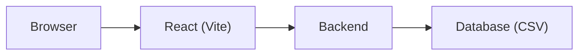

# Aladdin Clone


*This application was created by leveraging different A.I models. A code review with issues to resolve is attached in the docs folder. Download and open the code review html file to view.*

**Tech stack:** React, TypeScript, Vite, FastAPI, Python 3.11, JWT (Python-JOSE), Pydantic, CSV-backed storage.

A simplified clone of an Aladdin-style investment management platform: React frontend, Python (FastAPI) backend, and CSV-backed storage. Users can log in and manage portfolios, risk scenarios, orders, operations, private markets, reports, ESG data, wealth models, integrations, and preferences.

## Architecture



Browser → React (Vite) → Backend → Database (CSV). The backend is the only component that calls the database (`backend/data/`).

## How to run

### Prerequisites

- **Backend:** Python 3.11+
- **Frontend:** Node.js 18+ and npm

### 1. Run locally

#### Backend

1. Create a virtual environment and install dependencies:

   ```bash
   cd backend
   python -m venv .venv
   .venv\Scripts\activate   # Windows
   # source .venv/bin/activate   # macOS/Linux
   pip install -r requirements.txt
   ```

2. (Optional) Seed a default user and ensure `data/` exists (run from `backend/`):

   ```bash
   python -m scripts.seed_data
   ```

   If you skip this, the API will create the default user on first startup.

3. (Optional) Populate believable demo data for the demo account (portfolios, holdings, risk scenarios, orders, accounts, integrations, etc.):

   ```bash
   python -m scripts.seed_demo_data
   ```

   This clears any existing demo data and repopulates it. Log in as `demo` / `demo` to see the data.

4. Run the API (from the `backend/` directory):

   ```bash
   python -m uvicorn app.main:app --reload --host 127.0.0.1 --port 8000
   ```

   The API will serve at `http://127.0.0.1:8000`. Data is stored under `backend/data/` as CSV files (one file per table).

**API documentation:** When the backend is running, interactive API docs are available at [http://127.0.0.1:8000/docs](http://127.0.0.1:8000/docs) (Swagger UI) and [http://127.0.0.1:8000/redoc](http://127.0.0.1:8000/redoc) (ReDoc).

#### Frontend

1. Install dependencies and start the dev server:

   ```bash
   cd frontend
   npm install
   npm run dev
   ```

   The app will be at `http://localhost:5173`. It proxies `/api` to the backend (port 8000).

2. Log in with the default user:

   - **Username:** `demo`  
   - **Password:** `demo`

### 2. Docker

Docker is not set up in this repo. You can add Dockerfiles and `docker-compose` for a one-command run (see project docs or the “Docker and one-command run” section of the plan).

### 3. Testing

- **Backend** (from `backend/`): `pip install -r requirements.txt` then `python -m pytest tests/ -v`
- **Frontend** (from `frontend/`): `npm run lint` then `npm run build` (add `npm run test` when frontend tests are added)

See the [Testing](#testing) section below for details.

## Project layout

- **backend/** — FastAPI app
  - `app/main.py` — App entry, CORS, lifespan
  - `app/core/` — Config, auth (JWT)
  - `app/db/csv_store.py` — CSV read/write abstraction
  - `app/api/` — Auth and v1 routers (portfolios, risk, trading, operations, private-markets, data-analytics, esg-climate, wealth, ecosystem, design-principles)
  - `data/` — CSV tables (created at runtime)
  - `tests/` — Backend tests (pytest)
- **frontend/** — Vite + React + TypeScript
  - `src/` — App, router, auth context, API client, layout, and feature pages with CRUD UI

## Testing

One-liner commands are in [How to run → 3. Testing](#3-testing).

Backend tests live in `backend/tests/` and use pytest with FastAPI’s `TestClient`. They run against a temporary data directory (no need to touch `backend/data/`).

From the `backend/` directory:

```bash
pip install -r requirements.txt
python -m pytest tests/ -v
```

Tests cover auth (login, register, protected routes, invalid token) and portfolios (CRUD and user isolation).

## Features (from report)

1. **Whole-Portfolio Management** — Create and manage portfolios (name, currency) and their holdings (symbol, asset class, quantity, average cost). View portfolio totals and holdings in tables and pie charts.
2. **Risk Analytics** — Define risk scenarios (e.g. stress tests) and attach results per portfolio and metric. Compare scenario results across portfolios in bar charts.
3. **Trading and Order Management** — Create and track orders linked to portfolios (symbol, side, quantity, order type, status). Manage order life cycle from placement to execution.
4. **Operations and Accounting** — Manage client accounts and transactions (credits, debits, dates). Keep a simple ledger view of account activity.
5. **Private Markets and Alternatives** — Manage funds and commitments (fund, amount, currency, date). Track capital calls and commitments for alternative investments.
6. **Data and Analytics** — Save and list reports (name, type, parameters). Store report configurations for reuse and auditing.
7. **ESG and Climate** — View and manage ESG scores and climate-related metrics per portfolio. Track environmental, social, and governance data at the portfolio level.
8. **Wealth Management** — Define model portfolios and link client accounts to them. Support discretionary and advisory workflows with model allocation tracking.
9. **Ecosystem and Infrastructure** — Manage integrations (name, type, config). Track external systems and APIs connected to the platform.
10. **Design Principles** — Store user preferences as key/value pairs. Customize display and behavior (e.g. theme, defaults) per user.

All data is user-scoped; the backend filters by the authenticated user’s ID.

---

## How to sign in

1. **Start the app** — Ensure the backend is running on port 8000 and the frontend on port 5173 (see Backend and Frontend sections above).
2. **Open the app** — In a browser go to `http://localhost:5173`.
3. **Sign in** — Click **Sign in** (or go to `/login`), enter your username and password, then click **Sign in**. You are taken to the app dashboard at `/app`.
4. **Demo account** — To try the app with sample data, sign in with username **`demo`** and password **`demo`** (after running the seed scripts as described in Backend).
5. **Create an account** — From the login page, use the **create an account** link to go to `/signup`. Enter username, password, confirm password, and optional display name, then submit. You are signed in automatically and taken to the dashboard.

After signing in, use the sidebar to open any feature (Portfolio, Risk, Trading, Operations, etc.). Signing out returns you to the landing page.


## Tests


